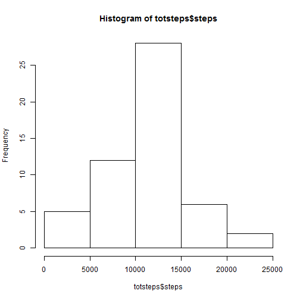
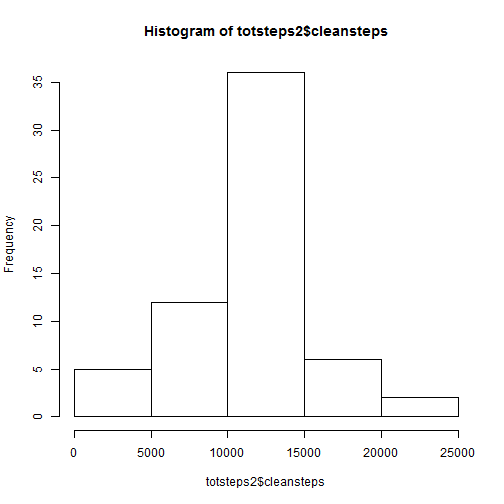
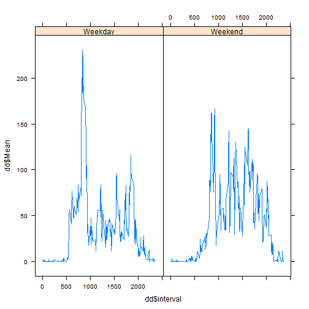

Reproducible Research - Assignment 1
========================================================

## Loading and preprocessing the data

First, we get the dataset read:

```r
unzip("activity.zip")
```

Read Dataset into R

```r
File <- read.csv("activity.csv")
```


## What is mean total number of steps taken per day?

1. Make a histogram of the total number of steps taken each day


```r
hist(File$steps)
```

 

2. Calculate and report the mean and median total number of steps taken per day.


```r
mean(File$steps, na.rm=TRUE)
```

```
## [1] 37.3826
```

```r
median(File$steps, na.rm=TRUE)
```

```
## [1] 0
```

## What is the average daily activity pattern?

1. Make a time series plot of the 5-minue interval and average number of steps taken

```r
avgsteps <- aggregate(steps~interval,File,mean)

plot(avgsteps$interval, avgsteps$steps,type="n")
lines(avgsteps$interval, avgsteps$steps)
```

 

2. Which 5-minute interval contains the maximum average number of steps?

```r
avgsteps[which.max(avgsteps[,2]),]
```

```
##     interval    steps
## 104      835 206.1698
```

## Imputing missing values

1. Calculate and report the total number of missing values in the dataset.

```r
sum(is.na(File$steps))
```

```
## [1] 2304
```

2. Devise strategy for imputing missing values. Impute NAs based on average number of steps take in that interval, rounding up.

```r
merged <- merge(File,avgsteps,by.x="interval",by.y="interval",all=TRUE)

merged$cleansteps <- round(ifelse(is.na(merged$steps.x), 
                                  merged$cleansteps <- merged$steps.y,merged$cleansteps <- merged$steps.x))
```

3. Create a new dataset ('merged') that is equal to the original dataset but with the missing data filled in.

```r
merged$steps.x <- NULL
merged$steps.y <- NULL
```

4. Make a historgram of steps taken by day and report the mean and median total steps taken per day.

Histogram

```r
hist(merged$cleansteps)
```

 

Mean

```r
mean(merged$cleansteps, na.rm=TRUE)
```

```
## [1] 37.38069
```
We can see that the mean of the dataset with the imputed values is lower than the incomplete dataset.
This is not surprising given the fact that the majority of dataset has zeros.


Median

```r
median(merged$cleansteps, na.rm=TRUE)
```

```
## [1] 0
```
We can see that the median is the same in both the imputed and incomplete datasets.


## Are there differences in activity patterns between weekdays and weekends?

1. Create new factor variable that indicates 'Weekday' and 'Weekend'

```r
merged$date <- as.Date(merged$date)

merged$day <- ifelse(weekdays(merged$date) %in% c("Saturday","Sunday"),"Weekend","Weekday")

install.packages("data.table")
```

```
## Error in contrib.url(repos, "source"): trying to use CRAN without setting a mirror
```

```r
library(data.table)

avgsteps1 <- data.table(merged)

avgsteps2 <- avgsteps1[,Mean:=mean(cleansteps),by=list(interval,day)]

avgsteps2$date <- NULL
avgsteps2$cleansteps <- NULL

dd <- unique(avgsteps2)
```

2. Make a paned containing a time series plot of interval and average steps take by day.

```r
library(lattice)
xyplot(dd$Mean ~ dd$interval | dd$day, layout = c(2,1), type="l")
```

 
